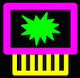

# CrystalQuest
This is a remake of the classic game designed for the 1987 Macintosh. It uses HTML5 Canvas, Sprites, Javascript, and jQuery.

Crystal Quest features **fifteen** different levels and **eight** different kinds of aliens (so far!). Each alien has its own look, its own dangers, and its own way of moving. Each wave increases in difficulty, and features increasingly perilous foes.

See if you can beat it!

[Play Crystal Quest](https://haleymt.github.io/CrystalQuest)

### Gameplay
* Move your ship around using the direction keys
* Scoop up all the crystals in order to open the gate.
* Don't run into the aliens, asteroids, or portals or you'll lose a life.
* Lose all your lives and it's game over.
* You can use your cherry bombs to clear the screen if you're in danger.
* If you collect the big crystal you'll gain a life and some bonus points.
* Press the space bar to shoot some aliens.

### Aliens





Each alien changes direction regularly. Accomplishing this requires two parts. First, I have to create a random movement vector for the alien:
```javascript
Util.randomVec = function (length) {
  var deg = 2 * Math.PI * Math.random();
  return Util.scale([Math.sin(deg), Math.cos(deg)], length);
};

Util.scale = function (vec, m) {
  return [vec[0] * m, vec[1] * m];
};
```
Next, I start an interval running when I create the alien that changes its movement vector every half second:

```javascript
var that = this;
this.dirInterval = setInterval( function () {
  that.vel = window.CrystalQuest.Util.randomVec(3);
}, 500);
```
If I want to change how fast an alien moves, I just change the argument for `randomVec`. A similar principle applies for creating and moving bullets.

If an alien hits a wall I want it to bounce off in an opposite but random direction:
```javascript
Wave.prototype.bounce = function (object) {
  xVel = object.vel[0];
  yVel = object.vel[1];
  var dirs = [-1, 1];
  var idx = Math.floor(Math.random() * 2);

  if (xVel < 0 && yVel < 0) {
    object.vel = [-xVel, dirs[idx] * yVel]
  } else if (xVel < 0 && yVel > 0) {
    object.vel = [dirs[idx] * xVel, -yVel]
  } else if (xVel > 0 && yVel > 0) {
    object.vel = [-xVel, dirs[idx] * yVel]
  } else if (xVel > 0 && yVel < 0) {
    object.vel = [dirs[idx] * xVel, -yVel]
  } else if (xVel === 0 && yVel !== 0) {
    object.vel = [xVel, -yVel]
  } else if (yVel === 0 && xVel !== 0) {
    object.vel = [-xVel, yVel]
  }
};
```
### Waves
Each wave's attributes are defined in an Object:

```javascript
Game.WAVE_EIGHT = {
    numAsteroids: 10,
    numBombs: 1,
    numCrystals: 25,
    numComputerAliens: 5,
    numBasicAliens: 1,
    numBigCrystals: 0,
    numPoints: 3
  };
```
The array `Game.WAVES` holds all of these objects. The game keeps track of what wave it's on by incrementing a counter that refers to an index in `Game.WAVES`.

### Intervals
Javascript's `setInterval` is notoriously tricky. It is strict about scope, it doesn't return any values, and any child `setInterval`s nested inside of another parent `setInterval` will *keep running* even after a parent interval is cleared. This poses potentially huge performance problems. To fix it, I carefully clear any intervals I create throughout the game:

* All intervals are defined at the top level (`this.interval` instead of `var interval`). Which means I can define a method on the top level that clears those intervals:
```javascript
Game.prototype.stop = function() {
  if (this.interval) {
    clearInterval(this.interval);
    this.interval = null;
  }
};
```
I can then call `this.stop()` during the winning or losing scenario.
* Upon destroying an alien, all of its intervals get cleared as well:
```javascript
if (object instanceof CrystalQuest.ShooterAlien) {
  clearInterval(object.shootInterval);
  object.shootInterval = null;
  this.aliens.splice(this.aliens.indexOf(object), 1);
```
* Upon finishing a level, I iterate through all the remaining aliens, and clear their movement and shooting intervals as well.

### High Scores
For now, high scores are stored in the localStorage and not in a database.

If you're running the game for the first time, it will create an item called `"high-scores"` upon initialization and set it to an empty array:
```javascript
Game.prototype.run = function () {
  if (this.scores === null) {
    localStorage.setItem("high-scores", JSON.stringify([]));
    this.scores = JSON.parse(localStorage.getItem("high-scores"));
  }
  ...
};
```
The array will eventually contain a collection of Objects containing a name and score, which we'll set at the end of a wave like so:
```javascript
Game.prototype.lose = function() {
  ...
  var score = parseInt($('#score').text())
  if ((this.scores.length < 10) || (score > this.scores[this.scores.length - 1]['score'])) {
    var name = prompt("You got a new high score! Enter your initials: ");
    if ((name !== "") && (name !== null)) {
      if (this.scores.length === 10) {
        this.scores.pop();
      }
      this.scores.push({'name': name, 'score': score})
      this.scores.sort( function(a, b) {
        return b['score'] - a['score'];
      });
      localStorage.setItem("high-scores", JSON.stringify(this.scores));
    }
    this.showHighScores();
  }
  ...
};
```
And then at the beginning of a new game, we'll just grab all the scores:
```javascript
var Game = window.CrystalQuest.Game = function (xDim, yDim, ctx) {
  ...
  this.scores = JSON.parse(localStorage.getItem("high-scores"));
  ...
};
```
Easy peasy.
